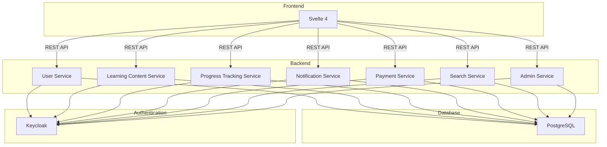

# Architecture for English Learning Web App

## Overview
This document outlines the architecture for an English Learning Web Application. The application is designed using a microservices architecture to ensure scalability, maintainability, and flexibility. The tech stack includes Svelte 4 for the frontend, Go for the backend, PostgreSQL as the database, and Keycloak for authentication and authorization. The backend follows a layered architecture with business, handler, and service layers.

## Business Logic Alignment

This architecture is business-first and must support the following outcomes:

- Increase learner completion rate through progress, streak, and badge logic.
- Improve teacher retention through class ownership, analytics, and invitation workflows.
- Protect revenue flows through subscription, invoice, and payment reconciliation rules.
- Keep governance auditable through admin controls, moderation, and feature flags.

Core domain rules:

- Role model is strict: `student`, `teacher`, `admin`.
- Teacher-only actions: create/publish course content, manage classes, invite students.
- Student-only actions: enroll, consume lessons, generate progress and attempts.
- Admin-only actions: role/status updates, moderation, feature flags, audit access.
- Archive semantics must be soft delete for business recoverability and compliance.

Business KPIs this architecture should enable:

- Activation rate (registration to first lesson).
- Course completion rate by cohort and class.
- Teacher class performance and learner progression.
- Conversion and retention for paid plans.
- Notification delivery success and re-engagement performance.
    
---

## Tech Stack

### Frontend
- **Framework**: Svelte 4
- **Purpose**: Provides a reactive and efficient user interface for the application.

### Backend
- **Language**: Go
- **Router**: Chi Router
- **ORM**: GORM
- **Authentication**: Keycloak with JWT
- **Database**: PostgreSQL

---

## Updated Microservices Architecture
The platform uses bounded-context microservices. Each service owns its business rules, HTTP handlers, and persistence logic (when needed), and communicates through REST and async events.

### Cross-Service Conventions
- Base API prefix: `/api/v1`
- Auth: `Authorization: Bearer <jwt>` (validated against Keycloak JWK)
- Role model in User Service:

```text
UserRole enum: student | teacher | admin
```

- Common middleware in Chi:
  - `RequestID`
  - `Recoverer`
  - `JWTAuth`
  - `RBAC`
  - `RateLimit`
- Layering in each service:
  - Handler layer: request validation and transport mapping
  - Service layer: business workflows and policies
  - Repository layer: GORM and PostgreSQL access

### Services

1. **User Service**
   - **Domain**:
     - Identity profile, learning preferences, timezone, language level, and role (`student` or `teacher`).
   - **Core responsibilities**:
     - Account lifecycle (register, activate, deactivate).
     - Profile management and role-aware capabilities.
     - Class ownership for teachers and enrollment relationship for students.
   - **Routing**:
     - `POST /users/register`: Register a new account.
     - `POST /users/login`: Exchange credentials for JWT/session.
     - `POST /users/refresh-token`: Refresh access token.
     - `POST /users/logout`: Revoke current session/token.
     - `GET /users/me`: Get current authenticated profile.
     - `PATCH /users/me`: Update own profile.
     - `GET /users/{id}`: Get user by id (self/admin).
     - `PATCH /users/{id}/status`: Activate/suspend account (admin).
     - `GET /users/{id}/settings`: Get user preferences.
     - `PUT /users/{id}/settings`: Update user preferences.
   - **Student routes**:
     - `GET /students/{id}/enrollments`: List enrolled courses.
     - `POST /students/{id}/enrollments`: Enroll in a course.
     - `DELETE /students/{id}/enrollments/{courseId}`: Unenroll from a course.
   - **Teacher routes (extra)**:
     - `POST /teachers`: Create teacher profile.
     - `GET /teachers/{id}`: Get teacher profile.
     - `PATCH /teachers/{id}`: Update teacher bio, expertise, and availability.
     - `GET /teachers/{id}/classes`: List classes owned by teacher.
     - `POST /teachers/{id}/classes`: Create a new class.
     - `PATCH /teachers/{id}/classes/{classId}`: Update class metadata.
     - `DELETE /teachers/{id}/classes/{classId}`: Archive class.
     - `POST /teachers/{id}/students/{studentId}/invite`: Invite student to class.
     - `GET /teachers/{id}/analytics`: Teacher-level performance analytics.

2. **Learning Content Service**
   - **Domain**:
     - Course structure, modules, lessons, quizzes, exercises, and assets.
   - **Core responsibilities**:
     - Content lifecycle from draft to publish.
     - Versioning and teacher ownership.
     - Tag and CEFR-level mapping (A1-C2).
   - **Routing**:
     - `GET /courses`: List courses.
     - `POST /courses`: Create course (teacher/admin).
     - `GET /courses/{courseId}`: Get course detail.
     - `PATCH /courses/{courseId}`: Update course.
     - `DELETE /courses/{courseId}`: Archive course (soft delete).
     - `POST /courses/{courseId}/publish`: Publish course.
     - `GET /courses/{courseId}/modules`: List modules.
     - `POST /courses/{courseId}/modules`: Add module.
     - `PATCH /modules/{moduleId}`: Update module.
     - `DELETE /modules/{moduleId}`: Archive module (soft delete).
     - `GET /modules/{moduleId}/lessons`: List lessons.
     - `POST /modules/{moduleId}/lessons`: Create lesson.

3. **Progress Tracking Service**
   - **Domain**:
     - Completion, quiz attempts, score history, streaks, and badges.
   - **Core responsibilities**:
     - Record events per user and per class.
     - Generate progress snapshots and aggregated metrics.
   - **Routing**:
     - `POST /progress/events`: Record learning event.
     - `GET /progress/users/{userId}`: Get user progress dashboard.
     - `GET /progress/users/{userId}/courses/{courseId}`: Get per-course progress.
     - `GET /progress/users/{userId}/streak`: Get streak info.
     - `GET /progress/users/{userId}/badges`: List earned badges.
     - `POST /progress/quiz-attempts`: Record quiz attempt.
     - `GET /progress/classes/{classId}/summary`: Teacher class summary.
     - `GET /progress/teachers/{teacherId}/overview`: Teacher overview analytics.

4. **Notification Service**
   - **Domain**:
     - In-app, email, and scheduled reminders.
   - **Core responsibilities**:
     - Template-based notification dispatch.
     - Delivery status tracking and retries.
   - **Routing**:
     - `POST /notifications`: Send notification.
     - `GET /notifications/users/{userId}`: List user notifications.
     - `PATCH /notifications/{notificationId}/read`: Mark as read.
     - `POST /notifications/bulk`: Bulk send notifications.
     - `POST /notifications/schedules`: Create scheduled notification.
     - `GET /notifications/schedules/{scheduleId}`: Get schedule.
     - `DELETE /notifications/schedules/{scheduleId}`: Cancel schedule.

5. **Payment Service**
   - **Domain**:
     - Subscriptions, invoices, transactions, coupons.
   - **Core responsibilities**:
     - Plan assignment and recurring billing state.
     - Webhook reconciliation from payment providers.
   - **Routing**:
     - `GET /plans`: List subscription plans.
     - `POST /subscriptions`: Create subscription.
     - `GET /subscriptions/{subscriptionId}`: Get subscription detail.
     - `PATCH /subscriptions/{subscriptionId}`: Upgrade or downgrade plan.
     - `DELETE /subscriptions/{subscriptionId}`: Cancel subscription.
     - `GET /payments/users/{userId}`: List payment history.
     - `GET /invoices/users/{userId}`: List invoices.
     - `POST /coupons/validate`: Validate coupon.
     - `POST /payments/webhooks`: Provider webhook callback.

6. **Search Service**
   - **Domain**:
     - Unified search index for courses, lessons, teachers, and tags.
   - **Core responsibilities**:
     - Full-text search with filters and facets.
     - Re-indexing and ranking tuning.
   - **Routing**:
     - `GET /search`: Global search by keyword.
     - `GET /search/courses`: Search courses.
     - `GET /search/lessons`: Search lessons.
     - `GET /search/teachers`: Search teachers.
     - `POST /search/reindex`: Trigger full reindex (admin).
     - `POST /search/reindex/courses/{courseId}`: Reindex a course.

7. **Admin Service**
   - **Domain**:
     - Operational governance and moderation controls.
   - **Core responsibilities**:
     - Centralized administrative actions and audit logs.
     - Policy and feature flag management.
   - **Routing**:
     - `GET /admin/users`: List users with filters.
     - `PATCH /admin/users/{userId}/roles`: Update user roles.
     - `PATCH /admin/users/{userId}/status`: Suspend/restore account.
     - `GET /admin/content/review`: List pending content moderation items.
     - `POST /admin/content/{contentId}/approve`: Approve content.
     - `POST /admin/content/{contentId}/reject`: Reject content.
     - `GET /admin/audit-logs`: Query audit logs.
     - `GET /admin/system/health`: Aggregated service health.
     - `PUT /admin/feature-flags/{flagKey}`: Update feature flag.

---

## Architecture Diagram
Below is a visual representation of the system architecture:



This diagram illustrates the interaction between the frontend, backend services, database, and authentication system.

---

## Backend Layered Architecture

### 1. Handler Layer
- **Responsibility**: Handles HTTP requests and responses.
- **Implementation**: Uses Chi Router to define routes and middleware.
- **Example**:
  ```go
  r := chi.NewRouter()
  r.Get("/users/{id}", userHandler.GetUser)
  ```

### 2. Service Layer
- **Responsibility**: Contains business logic and orchestrates calls to the repository layer.
- **Implementation**: Defines interfaces for services to ensure testability.
- **Example**:
  ```go
  type UserService interface {
      GetUserByID(id string) (*User, error)
  }
  ```

### 3. Repository Layer
- **Responsibility**: Interacts with the database using GORM.
- **Implementation**: Encapsulates database queries and ensures separation of concerns.
- **Example**:
  ```go
  type UserRepository interface {
      FindByID(id string) (*User, error)
  }
  ```

---

## Authentication and Authorization
- **Keycloak**: Used for managing users, roles, and permissions.
- **JWT**: Used for stateless authentication between the frontend and backend.
- **Integration**:
  - Backend verifies JWT tokens in middleware.
  - Keycloak handles user login, registration, and role assignments.

---

## Database Design
- **Database**: PostgreSQL
- **Schema**:
  - Users Table: Stores user information.
  - Lessons Table: Stores learning content.
  - Progress Table: Tracks user progress.
  - Notifications Table: Stores notification data.

---

## Frontend-Backend Communication
- **Protocol**: RESTful APIs
- **Authentication**: JWT tokens included in the Authorization header.
- **Error Handling**: Standardized error responses with HTTP status codes.

---

## Deployment
- **Frontend**: Deployed as a static site on a CDN.
- **Backend**: Deployed as containerized microservices using Docker.
- **Database**: Hosted on a managed PostgreSQL service.
- **Authentication**: Keycloak deployed as a standalone service.

---

## Future Enhancements
- Add support for WebSockets for real-time features.
- Implement GraphQL for more flexible data querying.
- Introduce AI-based personalized learning recommendations.

## Business Acceptance Checklist

Use this checklist before releasing a new architecture change:

- Role-based behavior is correctly enforced in all affected services.
- Learner, teacher, and admin journeys remain consistent end-to-end.
- Payment and subscription flows are idempotent and auditable.
- Progress and analytics data remain accurate after changes.
- Operational controls (audit logs, moderation, feature flags) are unaffected.
- Error handling preserves business continuity (no silent data loss).

---

This architecture ensures a robust, scalable, and maintainable application that can evolve with future requirements.